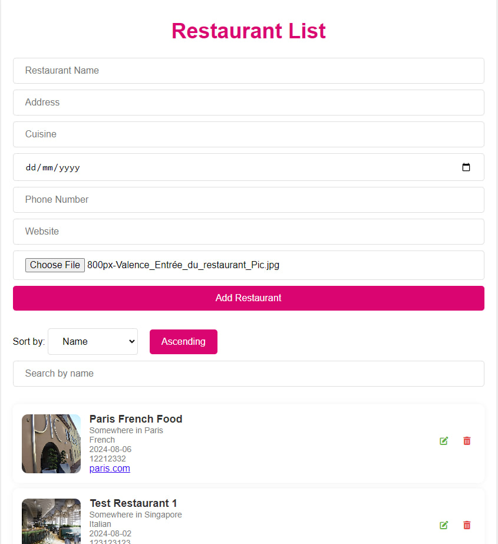
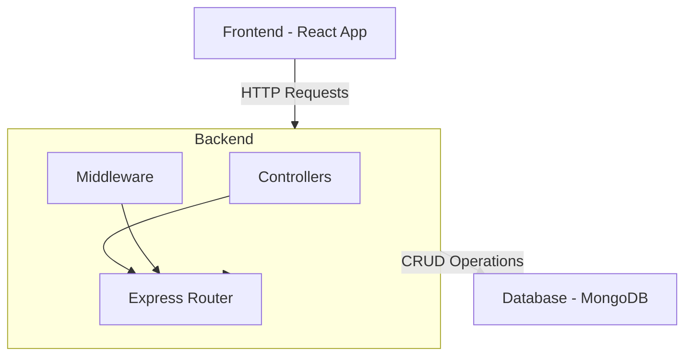

# Restaurant List Web App
## Overview

This is a web application to keep track of restaurants you want to visit. You can upload, modify, delete, and sort restaurant details. The design is inspired by the Burpple app for a clean and user-friendly experience.

## Tech Stack

### Frontend

- **HTML, CSS, JavaScript, React**: Used to build a dynamic and interactive user interface.

### Backend

- **Node.js, Express.js**: Used to handle server-side logic and API requests.

### Database

- **MongoDB**: Used to store restaurant details in a flexible and scalable way.

## Non-Functional Considerations

1. **Performance**: Ensured by using efficient frontend and backend frameworks and a fast database.
2. **Security**: Implemented through secure coding practices and tools to protect user data.
3. **Scalability**: Achieved by using scalable technologies that can handle increasing amounts of data and users.
4. **Maintainability**: Ensured by using modular code structures and best practices for easy updates and debugging.
5. **User Experience**: Focused on creating an intuitive and responsive interface for smooth user interactions.

## High-Level Architecture

